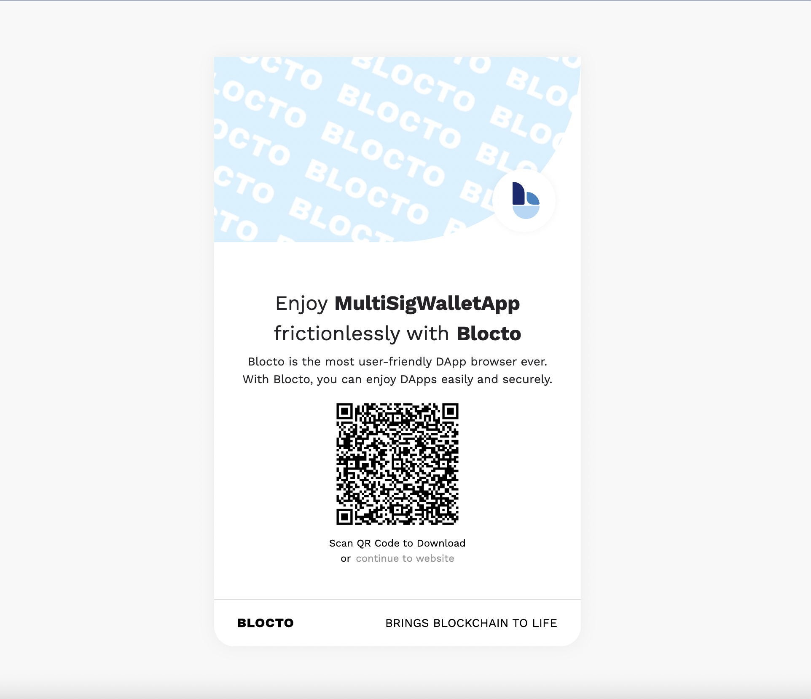

# FlowRepo

this is a develop repo for learning flow Blockchain

### Blocto ウォレットとは

Blocto ウォレットは初めて FLOW に対応したモバイルウォレット。

<strong>特徴</strong>

- ユーザーに優しい手数料設計
- セキュリティを安全かつ簡素に
- ブロックチェーン ID を作成する
- スマートコントラクトによるウォレットサービス

### Blocto Ethereum SDK

- Get access to all the web3.js functionalities
  - Interact with Ethereum-like networks
    - Ethereum Mainnet & Rinkeby Testnet
    - BSC Mainnet & Tesnet
  - Sign transactions
  - Send transactions
  - Lookup smart contract state
  - Query smart contract events
  - ... and a lot more
- Seamless onboarding experience  
  Users can sign up easily with email and start exploring you dApp in seconds.
- Fee subsidization  
  You have the option to pay transaction fee for your users and provide a better experience. In that case, we will generate daily fee reports for you to review.
- Integrated payment  
  Get paid easily with our payment APIs. Users can pay easily with credit cards or other crypto currencies like Bitcoin, Ethereum, Tron, USDT, ...
- Connected to Blocto App  
  Once you've integrated with Blocto SDK, your users can manage their assets easily and securely through Blocto App. Your dApp can tap into the vast blockchain ecosystem instantly.

### Install the Flow CLI

`brew install flow-cli`

`flow -h`

レスポンス例

```zsh
Usage:
flow [command]

Hot Commands:

deploy       Deploy all project contracts
init         Initialize a new configuration
run          Start emulator and deploy all project contracts

Available Commands:

accounts     Utilities to manage accounts
app          Utilities to create Flow app
blocks       Utilities to read blocks
cadence      Execute Cadence code
collections  Utilities to read collections
completion   Generate the autocompletion script for the specified shell
config       Utilities to manage configuration
dev-wallet   Starts a dev wallet
emulator     Starts the Flow emulator server
events       Utilities to read events
help         Help about any command
keys         Utilities to manage keys
project      Manage your Cadence project
scripts      Utilities to execute scripts
signatures   Signature verification and creation
snapshot     Utilities to download the latest finalized protocol state snapshot
status       Display the status of the Flow network
test         Run Cadence tests
transactions Utilities to send transactions
version      View version and commit information

Flags:
  -f, --config-path strings   Path to flow configuration file (default [/Users/harukikondo/flow.json,flow.json])
  -x, --filter string         Filter result values by property name
  -h, --help                  help for flow
      --host string           Flow Access API host address
  -l, --log string            Log level, options: "debug", "info", "error", "none" (default "info")
  -n, --network string        Network from configuration file (default "emulator")
      --network-key string    Flow Access API host network key for secure client connections
  -o, --output string         Output format, options: "text", "json", "inline" (default "text")
  -s, --save string           Save result to a filename
  -y, --yes                   Approve any prompts
Use "flow [command] --help" for more information about a command.
```

### Upgrade the Flow CLI

`brew upgrade flow-cli`

### Generate Key

`flow keys generate`

レスポンス例※下記の鍵は開発用！！

```zsh
🔴️ Store private key safely and don't share with anyone!
Private Key              aa82c278172073b9a84a71872b82021c5c10ce2f2f704dad0467d0422c8830b5
Public Key               a2462e7a65c0ab9f2856a12d53316d467d873370133c1920574ab5ded9afd67e8f93866557e0d8df6ca27f5e197e7c2044e85b5d3ccdf32ab2180bdf77df2ec0
Mnemonic                 weather middle make account peace fossil front measure antique girl account sorry
Derivation Path          m/44'/539'/0'/0/0
```

json 形式で出力した場合は下記のコマンド  
`flow keys generate --output json`

### Create Account

1. `flow init`

```zsh
Configuration initialized
Service account: 0xf8d6e0586b0a20c7

Start emulator by running: 'flow emulator'
Reset configuration using: 'flow init --reset'
```

2. `flow emulator`

```zsh
INFO[0000] ⚙️   Using service account 0xf8d6e0586b0a20c7  serviceAddress=f8d6e0586b0a20c7 serviceHashAlgo=SHA3_256 servicePrivKey=8a99d56dd364aace4f591dfb7f5c761395ac05e09d618fad959eeac765c37dd8 servicePubKey=cfd14c89f22695a20a7a566e3bfa7cf4ff5c1fbc11880bd22bb3d0e00b5f0552fda8f5e4a3546ae3482dfee9b54bbe73eb3e77cfcfeb032dfcba64b34be3a148 serviceSigAlgo=ECDSA_P256
INFO[0000] 📜  Flow contract                              FlowServiceAccount=0xf8d6e0586b0a20c7
INFO[0000] 📜  Flow contract                              FlowToken=0x0ae53cb6e3f42a79
INFO[0000] 📜  Flow contract                              FungibleToken=0xee82856bf20e2aa6
INFO[0000] 📜  Flow contract                              FlowFees=0xe5a8b7f23e8b548f
INFO[0000] 📜  Flow contract                              FlowStorageFees=0xf8d6e0586b0a20c7
INFO[0000] 🌱  Starting gRPC server on port 3569          port=3569
INFO[0000] 🌱  Starting REST API on port 8888             port=8888
INFO[0000] 🌱  Starting admin server on port 8080         port=8080
INFO[0000] ✅  Started admin server on port 8080          port=8080
INFO[0000] ✅  Started gRPC server on port 3569           port=3569
INFO[0000] ✅  Started REST API server on port 8888       port=8888
```

3. `flow accounts get <address>`

```zsh
Address  0xf8d6e0586b0a20c7
Balance  999999999.99700000
Keys     1

Key 0   Public Key               cfd14c89f22695a20a7a566e3bfa7cf4ff5c1fbc11880bd22bb3d0e00b5f0552fda8f5e4a3546ae3482dfee9b54bbe73eb3e77cfcfeb032dfcba64b34be3a148
        Weight                   1000
        Signature Algorithm      ECDSA_P256
        Hash Algorithm           SHA3_256
        Revoked                  false
        Sequence Number          0
        Index                    0

Contracts Deployed: 10
Contract: 'FlowIDTableStaking'
Contract: 'FlowEpoch'
Contract: 'FlowContractAudits'
Contract: 'FlowServiceAccount'
Contract: 'FlowStorageFees'
Contract: 'FlowClusterQC'
Contract: 'FlowDKG'
Contract: 'LockedTokens'
Contract: 'StakingProxy'
Contract: 'FlowStakingCollection'


Contracts (hidden, use --include contracts)
```

テストネットのアカウントのデータを取得する場合には下記のようなコマンドを打つこと  
`flow accounts get 0x11e681a52f08ed7a -n testnet`

レスポンス例

```zsh
Address  0x11e681a52f08ed7a
Balance  1000.00100000
Keys     1

Key 0   Public Key               d9e97f428ab0ee18e90c3761accf18cf2620ffa3b993c3a014aec32abb181a4bfa25d6f9bd5bc79031db507f337f64b774a6202ac4de4be88acd8c82055fcc35
        Weight                   1000
        Signature Algorithm      ECDSA_P256
        Hash Algorithm           SHA3_256
        Revoked                  false
        Sequence Number          0
        Index                    0

Contracts Deployed: 0


Contracts (hidden, use --include contracts)
```

4. `flow accounts create`

```zsh
Enter an account name: mashharuki
✔ Flow Testnet

❗ This command will perform the following:
 - Generate a new ECDSA P-256 public and private key pair.
 - Save the private key to mashharuki.private.json and add it to .gitignore.
 - Create a new account on Flow Testnet paired with the public key.
 - Save the newly-created account to flow.json.

Please complete the following steps in a web browser:
 1. Complete the captcha challenge.
 2. Click the 'Create Account' button.
 3. Return to this window.

You can also navigate to the link manually: https://testnet-faucet.onflow.org/?key=d9e97f428ab0ee18e90c3761accf18cf2620ffa3b993c3a014aec32abb181a4bfa25d6f9bd5bc79031db507f337f64b774a6202ac4de4be88acd8c82055fcc35

🎉 New account created with address 0x11e681a52f08ed7a and name mashharuki.

Here’s a summary of all the actions that were taken:
 - Added the new account to flow.json.
 - Saved the private key to mashharuki.private.json.
 - Added mashharuki.private.json to .gitignore.
```

### Deploy Contract with CLI

`flow accounts add-contract HelloWorld ./smartcontract/HelloWorld.cdc --signer mashharuki --network testnet`

レスポンス例

```zsh
Address  0x11e681a52f08ed7a
Balance  1000.00099756
Keys     1

Key 0   Public Key               d9e97f428ab0ee18e90c3761accf18cf2620ffa3b993c3a014aec32abb181a4bfa25d6f9bd5bc79031db507f337f64b774a6202ac4de4be88acd8c82055fcc35
        Weight                   1000
        Signature Algorithm      ECDSA_P256
        Hash Algorithm           SHA3_256
        Revoked                  false
        Sequence Number          1
        Index                    0

Contracts Deployed: 1
Contract: 'HelloWorld'


Contracts (hidden, use --include contracts)
```

### Upgrade Contract with CLI

`flow accounts upgrade-contract FungibleToken`

### remove Contract with CLI

`flow accounts remove-contract FungibleToken`

### Get Account Staking Info with CLI

`flow accounts staking-info mashharuki`

### Execute Script

`flow scripts execute <filename> [<argument> <argument>...] [flags]`

### Send Transaction

`flow transactions send <code filename> [<argument> <argument>...] [flags]`

`flow transactions send ./tx/Transaction1.cdc -n testnet --signer mashharuki`

```zsh
Transaction ID: 53393a4e46ee0f556863b40b08f7246517b18dc4508b9216f764415592091ab4

Status          ✅ SEALED
ID              53393a4e46ee0f556863b40b08f7246517b18dc4508b9216f764415592091ab4
Payer           11e681a52f08ed7a
Authorizers     [11e681a52f08ed7a]

Proposal Key:
    Address     11e681a52f08ed7a
    Index       0
    Sequence    1

No Payload Signatures

Envelope Signature 0: 11e681a52f08ed7a
Signatures (minimized, use --include signatures)

Events:
    Index       0
    Type        A.7e60df042a9c0868.FlowToken.TokensWithdrawn
    Tx ID       53393a4e46ee0f556863b40b08f7246517b18dc4508b9216f764415592091ab4
    Values
                - amount (UFix64): 0.00000199
                - from (Address?): 0x11e681a52f08ed7a

    Index       1
    Type        A.7e60df042a9c0868.FlowToken.TokensDeposited
    Tx ID       53393a4e46ee0f556863b40b08f7246517b18dc4508b9216f764415592091ab4
    Values
                - amount (UFix64): 0.00000199
                - to (Address?): 0x912d5440f7e3769e

    Index       2
    Type        A.912d5440f7e3769e.FlowFees.FeesDeducted
    Tx ID       53393a4e46ee0f556863b40b08f7246517b18dc4508b9216f764415592091ab4
    Values
                - amount (UFix64): 0.00000199
                - inclusionEffort (UFix64): 1.00000000
                - executionEffort (UFix64): 0.00000020


Code (hidden, use --include code)

Payload (hidden, use --include payload)
```

### Get Transaction

`flow transactions get <tx_id>`

### build Transaction

`flow transactions build ./tx/Transaction1.cdc --authorizer mashharuki --save ./tx/build/built.rlp`

```zsh
ID      dc8ae0a167734cbf50635ad8519e4fd7640cdcb7a6894b2e36ba11914bbec8a5
Payer   f8d6e0586b0a20c7
Authorizers     [11e681a52f08ed7a]

Proposal Key:
    Address     f8d6e0586b0a20c7
    Index       0
    Sequence    0

No Payload Signatures

No Envelope Signatures


Arguments       No arguments

Code

import HelloWorld from 0x11e681a52f08ed7a;

/**
 * Transaction
 */
transaction {

    // prepare
        prepare(acct: AuthAccount) {}

💾 result saved to: ./tx/build/built.rlp
```

### sign Transaction

`flow transactions sign ./tx/build/built.rlp --signer mashharuki --filter payload --save ./tx/signed/signedTx.rlp`

```zsh

```

### send signed Transaction

`flow transactions send-signed ./tx/signed/`

### generate signature

`flow signatures generate "test"`

```zsh
Signature                81011560982e5b9579de6c7d94907c8299a60899df2709030261d3f0df5fbe07aecd0ad91db78c52f95213b8eac6d0f9499a0722b483ddece151f4d51b1aa8b4
Message                  test
Public Key               0xcfd14c89f22695a20a7a566e3bfa7cf4ff5c1fbc11880bd22bb3d0e00b5f0552fda8f5e4a3546ae3482dfee9b54bbe73eb3e77cfcfeb032dfcba64b34be3a148
Hash Algorithm           SHA3_256
Signature Algorithm      ECDSA_P256
```

### Verify a Signature

`flow signatures verify "test" 81011560982e5b9579de6c7d94907c8299a60899df2709030261d3f0df5fbe07aecd0ad91db78c52f95213b8eac6d0f9499a0722b483ddece151f4d51b1aa8b4 0xcfd14c89f22695a20a7a566e3bfa7cf4ff5c1fbc11880bd22bb3d0e00b5f0552fda8f5e4a3546ae3482dfee9b54bbe73eb3e77cfcfeb032dfcba64b34be3a148`

```zsh
Valid                    true
Message                  test
Signature                81011560982e5b9579de6c7d94907c8299a60899df2709030261d3f0df5fbe07aecd0ad91db78c52f95213b8eac6d0f9499a0722b483ddece151f4d51b1aa8b4
Public Key               cfd14c89f22695a20a7a566e3bfa7cf4ff5c1fbc11880bd22bb3d0e00b5f0552fda8f5e4a3546ae3482dfee9b54bbe73eb3e77cfcfeb032dfcba64b34be3a148
Hash Algorithm           SHA3_256
Signature Algorithm      ECDSA_P256
```

### Blocto Wallet Tutorial

1. `cd my-app`
2. `npm i @onflow/fcl styled-components`

Blocto で生成したウォレットのアドレスは、[0x1c45052B39A0a0A01f71174554954c7418c44C95](https://mumbai.polygonscan.com/address/0x1c45052b39a0a0a01f71174554954c7418c44c95)

### Blocto Wallet 用のコントラクトを生成しているコントラクトアドレス

[0x20781013FAACce8F743BefEe48aef1420CA100E0](https://testnet.snowtrace.io/address/0x20781013FAACce8F743BefEe48aef1420CA100E0)

### Blocto Wallet で利用されている技術

- コントラクトウォレット
- スマートコントラクトからスマートコントラクトを生成する設計パターン(Factory パターン)
- メタトランザクション
- ワンタイムパスワード

### メタトランザクションとは

ガス代を支払わずに実行できるトランザクションのこと。  
マイナーに払うガス代を誰かに負担してもらうことができる。

### ユーザービリティでの改善案

- QR コードなどで行けると良い
- ウォレットを作成したあとは、アドレスなどの情報を知りたいはずなのでそれを表示できるアカウントページがあると良いのではないか？
  - アドレス
  - メールアドレス

### コントラクトウォレットとは

EOA ではなく、コントラクトウォレットをユーザーのウォレットとして使用するもの。  
イーサリアムの世界には 2 種類のアドレスが存在する。

- EOA(Externally Owned Address)  
  鍵ペアから生成される一般的なウォレットアドレス。秘密鍵を使って署名することでトランザクションを送信できる。
- コントラクトアドレス
  スマートコントラクトに付与されるアドレス。秘密鍵がないため署名ができない。(秘密鍵を保存する必要がない！)  
  そのため、基本的には EOA 起点でインターナルトランザクションを送信する形になる。

### IAP (Identity-Aware Proxy) とは

ユーザとアプリケーションの間で通信を仲介するプロキシの一つ。  
多くの IAP では大きく 3 つの機能を提供している。

- コネクター  
  IAP とオンプレミスアプリケーションの通信を中継するサーバ
- エージェント  
  しかし、エージェントを導入することで、Web アプリ以外のアプリケーションにも、IAP 経由でアクセスできるようになる
- 認証基盤連携  
  IAP 自身には、認証・認可機能がないので、別途 Azure AD や IDaaS などの認証基盤を用意し、IAM 連携で認証・認可を実施する。

### Blocto Wallet App の仕組みを介してマルチシグウォレットにアクセスする場合

[MultiSigDApp](https://blocto.app/link?url=https://multi-sig-wallet-contract.vercel.app&blockchains=mumbai)

### QRコードでサイトインするイメージ



## 想定業務フロー

[](https://mermaid.live/edit#pako:eNqNlF1PE0EUhv_KZq8gwQu43AsSEyThQqORxJverO1UG9pp3W7TEELCzqiAlPARpQGLUFI-_AJjRbSt9Mec7m75F56Z3a27QIVeNDszz7xzznvOzIwazyaIqql58qJAaJyMpfRnhp6JUQV_ZspME2Vi7JHD6_bxFvB3wL8CbykDzsa37sGKu9m8KH0HawnY4oPxSeA7wOvAF8A6B-tw0BPRC2aWFjJPieGP42bWUIAfoBCwn_gfns8WaQDmdMNMxVM5nZpKfljR80oQgDyDHcmPxaswFWwkHnYKrIYf1wiPCPjuwwnBYEB8tRdQGEsKalyGOA2s7svyj8BOrpUtCv6Jnk4T8za4KfDJ7BShSj9cGqPcGR1VkhoaMQ-8LLxgtcvL5nXLYbslhYZqSriKnfPti10_c1yUzIimeIvSn3V7rQVW3Z5vgLXpgyM9EHhV-vcZ2B5WBfgXYL9xk7NVtlfO7NJGZIfMYQU4B3YGfN-eq4FV8s5yfmH_tLF_wGLAlrC73L1G99MyHorDiEokK6F4IqxjbVnsXeBrIgQx2RIRsfWLOavTrvZ15BYK9qt9-837cCjJngNJPZ0nyHTbby8bhOn2a4bOn4qzsOqU5t1aI6xYvGmLBxcD2F7Ydio7_o3EIKolsF5HgsDGwKsshVpSqO5uNpCLlnI4qLl7uup8qHSrR73ArlhGhenB3QJLlh6FWRNdU_6zJ3w3w31HQ93kL9_QebLZ_yWEqPuyZS__CFeIRs5FQmbtEQPBoAzWgT231GngEcf9jMcU3cNmt7nnbR7sk2J4ondopIdjVB1SM8TI6KkEPr4zQiimms9JhsRUDT8TujEVU2N0FrlCLqGb5F4ihY-PqskuG1LFq_p4msZVzTQKJID817tHEbnpvvfEy5d-9i-mqe40)


## 東京Web3ハッカソンで開発予定の機能一覧

| 機能名                 | 説明                                                                                                     |
| ---------------------- | -------------------------------------------------------------------------------------------------------- |
| 登録 機能    | メールアドレスをキーとしてコントラクトに登録する。                                 |
| Reward機能     | IDQTokenをrewardとして受け取れる機能 |
| IDQトークンburn機能 | 機能を利用するためにburnする機能                                                                     |
| Factory機能   | ユーザー用のコントラクトウォレットを生成する機能                                                   |
| ワンタイム認証機能   | ワンタイムパスワードにより認証を行う機能                                                     |
| 他コントラクト呼び出し機能     | 他のコントラクトの機能を呼び出す機能                                                           |

### WalletContract V3で管理する変数

|No.|変数名|概要|型|
|---|---|---|---|
|1|userId|メールアドレスをハッシュ化したもの|string|
|2|walletMap|userIdと紐づくウォレットアドレス|mapping|
|3|isRegistered|メールアドレスが既に登録済みかであるかチェックするmap|mapping|

### CoreWallet V3で管理する変数

|No.|変数名|概要|型|
|---|---|---|---|
|1|userId|メールアドレスをハッシュ化したもの|string|
|2|openseaLink|openseaまでのURL|string|

### 参考文献

1. [Developer Portal](https://developers.flow.com/)
2. [Blocto Wallet ｜ウォレットの使い方と Flow のステーキング方法](https://dappsmarket.net/guide/blocto-howtouse/)
3. [Blocto Wallet](https://portto.com/)
4. [testnet faucet](https://testnet-faucet-v2.onflow.org/)
5. [Blocto Wallet 開発者向けドキュメント](https://docs.blocto.app/)
6. [敷居を下げる、充実したエコシステム：クロスブロックチェーンのスマートコントラクトウォレット「Blocto」を知る](https://coinpost.jp/?post_type=breaking&p=300918)
7. [Flow Playground](https://play.onflow.org/local-project)
8. [Emerald emerald academy logo Academy](https://academy.ecdao.org/)
9. [Testnet](https://testnet.flowscan.org/)
10. [Mainnet](https://flowscan.org/)
11. [EmeraldID](https://id.ecdao.org/me)
12. [beginner-cadence-course](https://github.com/mashharuki/beginner-cadence-course)
13. [beginner-dapp-course](https://github.com/emerald-dao/beginner-dapp-course)
14. [Install the Flow CLI](https://developers.flow.com/tools/flow-cli/install)
15. [DApps のユーザー認証に web3.eth.personal.sign を使おう！](https://tech.drecom.co.jp/dapps-use-web3-eth-personal-sign/)
16. [FCL Development Wallet](https://github.com/onflow/fcl-dev-wallet)
17. [Blocto Wallet zendesk](https://portto.zendesk.com/hc/en-us)
18. [How Blocto as a cross-chain smart contract wallet solve user & developer problems](https://portto.com/blocto-crypto-blog/ecosystem/cross-chain-smart-contract-wallet-solve-user-amp-developer-problems)
19. [Blocto Wallet Docs](https://docs.blocto.app/blocto-app/web3-provider/batch-transaction)
20. [Blocto for Developers](https://developers-testnet.blocto.app/)
21. [Blocto SDK JavaScript](https://docs.blocto.app/blocto-sdk/javascript-sdk/evm-sdk)
22. [Crypto Candy](https://github.com/amitkothari/crypto-candy)
23. [Blocto SDK in Flow dApps](https://docs.blocto.app/blocto-sdk/javascript-sdk/flow)
24. [Mermaid js Docs](https://mermaid-js.github.io/mermaid/#/)
25. [Mermaid js Live Editor](https://mermaid.live/edit#pako:eNpVj80OgkAMhF-l6UkTeQEOJgLKxUQTvbEcGqjsRvcnyxJjgHd30Yv21HS-mUxHbGzLmGLnyUm4FsJAnF2VS6_6oKmvIUm2U8kBtDX8miBblRZ6aZ1Tplt_-WyBIB-PC8YQpDL3-SvlH__J8ARFdSQXrKt_levTTrCv1FnG-H9Feo6uQ3Wj9EZJQx5y8h8EN6jZa1JtrD4uF4FBsmaBaVxb8neBwsyRoyHYy8s0mAY_8AYH11LgQlH8WGMMfvQ8vwGEfFP7)
26. [Mermaid js Tutorial](https://mermaid-js.github.io/mermaid/#/Tutorials)
27. [dapper-contracts](https://github.com/dapperlabs/dapper-contracts)
28. [FanTop のフロントエンド開発 − Web3 におけるユーザ認証](https://techdo.mediado.jp/entry/2022/09/21/090000)
29. [Web3-React](https://github.com/Uniswap/web3-react#readme)
30. [MetaMask Docs](https://docs.metamask.io/guide/ethereum-provider.html#methods)
31. [JPYCv2 のメタトランザクション機能の紹介](https://zenn.dev/jpyc/articles/ff5922abf2046c)
32. [「Dapper」はガス代がかからない仮想通貨ウォレット！インストール方法と特徴を解説（追記あり）](https://news.blockchaingame.jp/494#:~:text=%E6%96%B9%E3%81%AB%E3%82%AA%E3%82%B9%E3%82%B9%E3%83%A1-,1.Dapper%E3%81%A8%E3%81%AF%E3%83%96%E3%83%AD%E3%83%83%E3%82%AF%E3%83%81%E3%82%A7%E3%83%BC%E3%83%B3%E3%82%B2%E3%83%BC%E3%83%A0%E3%81%AE%E8%AA%B2%E9%A1%8C%E7%82%B9,%E9%80%9A%E8%B2%A8%E3%82%A6%E3%82%A9%E3%83%AC%E3%83%83%E3%83%88%E3%81%AE%E3%81%93%E3%81%A8%E3%81%A7%E3%81%99%E3%80%82)
33. [Dapper コントラクトのコードを理解する](https://qiita.com/avcdsld/items/2e97a553159e6d278b43)
34. [【Azure】クイック スタート:SMS メッセージを送信する](https://learn.microsoft.com/ja-jp/azure/communication-services/quickstarts/sms/send?tabs=windows&pivots=programming-language-javascript)
35. [Dapper Contract 解説/Dapper Contract](https://speakerdeck.com/avcdsld/dapper-contract?slide=35)
36. [IAP とは？VPN と比較しつつ、メリットを解説](https://solution.kamome-e.com/blog-security-20220706/)
37. [Cloud Run で Identity-Aware Proxy (IAP) を使う](https://zenn.dev/ww24/articles/19099c85febe0d)
38. [電話番号で本人確認を行う「SMS 認証」とは？仕組みを解説](https://ekyc.nexway.co.jp/blog/26)
39. [Node.js を使用したユーザーの認証](https://cloud.google.com/nodejs/getting-started/authenticate-users?hl=ja)
40. [GCP + Node.js を使用したユーザーの認証のサンプルコード](https://github.com/GoogleCloudPlatform/nodejs-getting-started/blob/HEAD/authenticating-users/app.js)
41. [Solidity by Example](https://solidity-by-example.org/)
42. [Twilio(トゥイリオ) の Quick Start (SMS)](https://www.twilio.com/ja/docs/verify/quickstarts/node-express#)
43. [Iroha React App](https://github.com/mashharuki/iroha)
44. [Ethers Docs](https://docs.ethers.io/v5/api/)
45. [ethers.jsとは(ethers.jsの基本概念や特徴の解説)](https://zenn.dev/nft/books/410be300912936/viewer/00c605)
46. [JavaScript の Import Assertions について](https://sosukesuzuki.dev/posts/import-assertions/)
47. [tutorials(send-token-etherjs)](https://ethereum.org/en/developers/tutorials/send-token-etherjs/)
48. [Simple Code(send Tx)](https://ethereum.stackexchange.com/questions/80867/sample-code-in-ethers-js-to-send-raw-transaction-and-to-sign-transaction)
49. [How to Mint an NFT from Code](https://docs.alchemy.com/docs/how-to-mint-an-nft-from-code)
50. [0x2CcfA2AcF6FF744575cCf306B44A59B11C32e44Bのコントラクト](https://etherscan.io/bytecode-decompiler?a=0x2ccfa2acf6ff744575ccf306b44a59b11c32e44b)
51. [Avalanche Docs](https://docs.avax.network/)
52. [hardhat Docs](https://hardhat.org/hardhat-runner/docs/guides/project-setup)
53. [Web3js 公式サイト](https://web3js.org/)
54. [Signing Raw Transactions](https://docs.etherscan.io/tutorials/signing-raw-transactions)
55. [ethers.jsを使ってMetaMaskで署名してNode.jsで検証する方法](https://zenn.dev/tatsuyasusukida/articles/how-to-sign-and-verify-ethersjs)
56. [Twilio(トゥイリオ) Verify API](https://www.twilio.com/docs/verify/api)